  

  
  
  
  
  
  

  

  
   
  

  
  
  
  
  
  
  
  

  
  
  
  

  

  <b>📜 Certified</b> 
  Data Science Master's — PW Skills &nbsp;·&nbsp; Data Analytics with Python — IBM 
  AWS Academy Cloud Architecting &nbsp;·&nbsp; AWS Machine Learning Foundations

  

  
  

  
  

  

